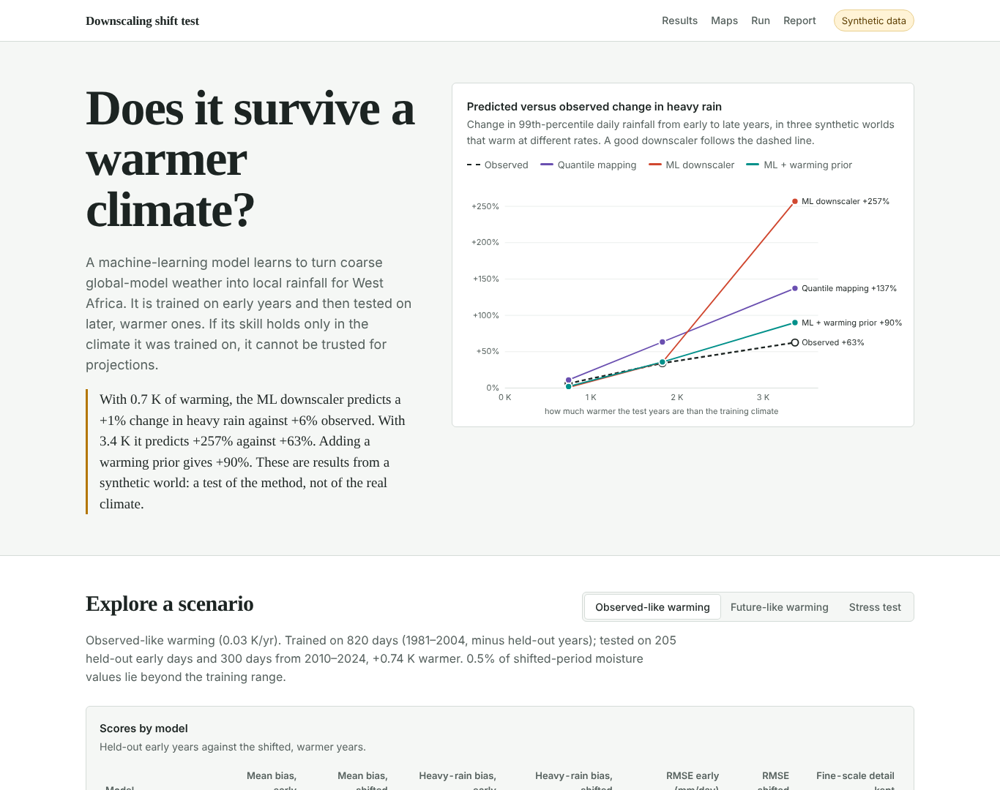

# Does it survive a warmer climate?

**A distribution-shift test for machine-learning rainfall downscaling over West Africa — with a web dashboard and an auto-generated report.**

Machine-learning downscalers learn how coarse, large-scale weather maps onto local rainfall. Climate projection asks them to apply that mapping in a warmer climate they never saw in training. This repository tests exactly that: train on early years, test on later and warmer years, and score what matters for climate risk — heavy-rain extremes, the *change* signal, spatial detail and calibrated uncertainty — not just average skill.

> **Data status.** Out of the box the pipeline runs on a built-in **synthetic** “West African monsoon” world with a known warming signal, so everything works offline in a few minutes. Those numbers test the *method*; they are not findings about the real climate. A real-data path (ERA5 predictors → CHIRPS rainfall) is included — see [`scripts/README.md`](scripts/README.md).



---

## Run it

### With Docker (recommended)

```bash
docker build -t shifttest .            # bakes the three warming scenarios into the image (~4 min)
docker run --rm -p 8000:8000 shifttest
# open http://localhost:8000
```

or `docker compose up --build`. Run the tests in the same image with
`docker compose --profile test run --rm tests`.

### Without Docker

```bash
python -m venv .venv && source .venv/bin/activate      # Windows: .venv\Scripts\activate
pip install -r requirements.txt
python -m shifttest sweep        # three scenarios -> results/  (~4 min on 2 CPUs)
python -m shifttest serve        # dashboard on http://localhost:8000
python -m pytest -q              # 18 tests
```

Other commands:

```bash
python -m shifttest run --preset quick                 # one fast run -> results/custom
python -m shifttest run --warming-rate 0.12 --seed 3   # your own scenario
python -m shifttest export                             # static site in site/ (for GitHub Pages)
```

## What the dashboard shows

- **Predicted versus observed change in heavy rain** across three synthetic worlds that warm at different rates — the headline test.
- Per scenario: a score table (mean and 99th-percentile bias, RMSE, fine-scale detail kept), a change-signal chart, the upper tail of the rainfall distribution, and power spectra of the daily rainfall maps.
- Maps of one heavy-rain day and of the early-to-late change in mean rainfall, with Lagos, Uyo and Kano marked.
- A **Run** panel to launch a new scenario (warming rate, seed) from the browser.
- The full **report**, generated from the run's own numbers, with Markdown and JSON downloads.

## The experiment

| | |
|---|---|
| Domain | 4–20°N, 10°W–15°E, June–September |
| Training | early years (1981–2005) minus every fifth year |
| In-distribution test | the held-out early years (1985, 1990, … 2005) |
| Shifted test | 2010–2024 (warmer) |
| Second test | train on the driest half of seasons, test on the wettest quarter |
| Predictors | moisture, large-scale ascent, temperature, coarse rainfall (interpolated), plus elevation, position, season |

**Models**

1. **Quantile mapping** — interpolate coarse rainfall, map its distribution onto observed rainfall pixel by pixel (statistical baseline).
2. **ML downscaler** — gradient-boosted trees, Poisson loss. Trees cannot predict beyond their training range, which makes extrapolation failure visible.
3. **ML + warming prior** — the same model trained in a warming-normalised space (moisture, rainfall and temperature rescaled at 7 % per K, Clausius–Clapeyron) and scaled back.
4. **ML 10–90 % interval** — quantile-loss trees, scored by coverage.

**Metrics:** mean and 99th-percentile bias, RMSE, wet-day frequency, fine-scale power ratio (spatial variability at scales finer than the coarse grid), interval coverage, and the share of the observed early→late change each model reproduces.

## Results on the synthetic world (v0.1.0, seed 7)

| Scenario | Warming of test years | Observed change in heavy rain | ML downscaler | ML + warming prior | Quantile mapping |
|---|---|---|---|---|---|
| Observed-like (0.03 K/yr) | +0.74 K | +6 % | +1 % | +2 % | +11 % |
| Future-like (0.08 K/yr) | +1.83 K | +34 % | +35 % | +36 % | +63 % |
| Stress test (0.15 K/yr) | +3.37 K | +63 % | +257 % | +90 % | +137 % |

What this toy world shows:

- **In-distribution skill hides the problem.** The ML downscaler underestimates 99th-percentile rainfall by 32–43 % even on held-out early years, because a deterministic regression averages away extremes. It keeps only 12–44 % of the observed fine-scale variability.
- **Moderate shifts are absorbed; large ones are not.** When test-period moisture stays inside the training range (0.5 % and 5 % of values outside it), the change signal is roughly reproduced. When 19 % of values fall outside it, the ML downscaler overshoots the heavy-rain change roughly fourfold.
- **A simple physical prior helps but does not fix it.** Normalising by a Clausius–Clapeyron scaling cuts the overshoot (+90 % vs +63 % observed) — but this world was built with storms intensifying faster than 7 % per K, so the prior is deliberately incomplete, and part of its advantage is built in.
- **Quantile mapping over-amplifies the change** in the two warmer worlds (+63 % vs +34 %, +137 % vs +63 %), although it has the smallest heavy-rain bias on held-out early years. Why it overshoots here has not yet been diagnosed.

The full numbers are in [`results/*/report.md`](results/) and `results/*/results.json`.

## Limits

- The synthetic world has simple, chosen physics. It is a test bed, not a climate model.
- The real-data path is perfect-prognosis downscaling against observations, **not** emulation of a convection-permitting model. The Met Office CPM ensemble for Africa is not public.
- A degree or so of observed warming is a weak proxy for end-of-century change.
- Gradient-boosted trees stand in for U-Net and diffusion emulators used in current work.
- Pixel-wise metrics do not test whether storms are organised realistically (e.g. mesoscale convective systems).
- The ERA5 and CHIRPS download scripts have not yet been run end-to-end (see `scripts/README.md`).

## Next steps

1. Run on ERA5 + CHIRPS, 1981–2024.
2. Add a convolutional U-Net and a probabilistic generative model; compare their shift penalty with the trees.
3. Add storm-object metrics (size, intensity, lifetime).
4. With convection-permitting simulations: train on present-day runs, test on future runs.

## Publish on GitHub

```bash
git remote add origin https://github.com/<you>/downscaling-shift-test.git
git push -u origin main
```

CI (`.github/workflows/ci.yml`) runs the tests, builds the Docker image and checks the dashboard responds. To publish the dashboard as a website, enable **Settings → Pages → Source: GitHub Actions**; `pages.yml` then runs the scenarios and deploys the static site (the Run panel is hidden there, since Pages has no server).

## Repository layout

```
shifttest/
  config.py      experiment settings and presets (quick, default, future, stress)
  synthetic.py   synthetic West African monsoon world with a warming trend
  realdata.py    NetCDF loader for real predictors and rainfall
  models.py      quantile mapping, gradient boosting, warming prior, quantile interval
  metrics.py     bias, extremes, spectra, interval coverage, change signal
  pipeline.py    splits, training, scoring, sweep over scenarios
  figures.py     map figures
  report.py      report generator (Markdown + HTML from the same blocks)
  server.py      FastAPI dashboard backend and static export
  web/           dashboard frontend (plain HTML/CSS/JS, no build step)
scripts/         ERA5 and CHIRPS download scripts
tests/           pytest suite (18 tests)
results/         three pre-computed scenarios with reports
```

## References

- Senior, C. A. et al. (2021). Convection-permitting regional climate change simulations for understanding future climate and informing decision-making in Africa. *BAMS* 102(6).
- Kendon, E. J. et al. (2025). Potential for machine learning emulators to augment regional climate simulations in provision of local climate change information. *BAMS* 106(6).
- Addison, H. et al. Machine learning emulation of precipitation from km-scale regional climate simulations using a diffusion model. arXiv:2407.14158.
- Hersbach, H. et al. (2020). The ERA5 global reanalysis. *QJRMS* 146(730).
- Funk, C. et al. (2015). The climate hazards infrared precipitation with stations. *Scientific Data* 2, 150066.

## Author and AI-use disclosure

Olanrewaju (Lanre) Agunloye — built as a pre-application study for the UNRISK Centre for Doctoral Training. The code and report template were written with the help of an AI assistant (Claude, Anthropic) and reviewed by the author. Every number in the reports is computed by the code at run time.

MIT licence.
