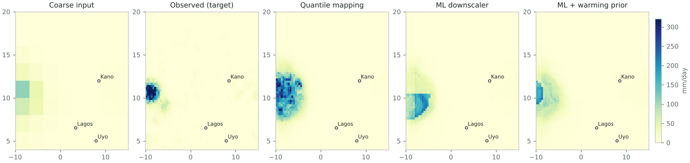
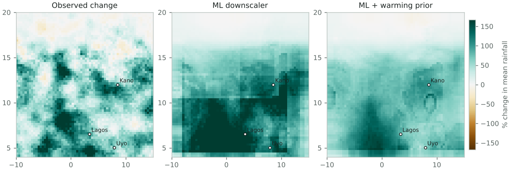

# Does it survive a warmer climate?

A distribution-shift test of machine-learning rainfall downscaling over West Africa.

> Data status: synthetic. Every number below comes from a simulated 'West African monsoon' world built into this repository, with a warming trend of 0.15 K per year chosen by the user. These results demonstrate that the test harness works and show how the models behave under a known shift. They are not findings about the real climate. Run the real-data path (ERA5 predictors, CHIRPS rainfall) to produce evidence about West Africa.

## Question

Machine-learning downscalers learn the link between coarse, large-scale weather and local rainfall from past data. Climate projection asks them to apply that link in a warmer future they have never seen. This study asks: when a downscaler is trained on an earlier period, how much does its skill on extreme rainfall degrade on a later, warmer period, and does a simple physical prior help?

## Design

| Set | Years | Days | Warming vs training (K) |
|---|---|---|---|
| Training | 1981–2004 | 820 | -0.00 |
| In-distribution test (held-out early years) | 1985, 1990, 1995, 2000, 2005 | 205 | +0.27 |
| Shifted test (later years) | 2010–2024 | 300 | +3.64 |

Domain 4.0–20.0°N, -10.0–15.0°E, June–September. Fine grid 64×64; coarse grid 8×8 (each coarse cell covers 8×8 fine cells). Predictors: moisture, large-scale ascent, temperature and coarse rainfall, bilinearly interpolated to the fine grid, plus elevation, position and season.

- Quantile mapping (baseline): interpolate coarse rainfall, then map its distribution onto the observed distribution pixel by pixel. Values beyond the training range are extended additively.
- ML downscaler: gradient-boosted trees with a Poisson loss, trained on 200,000 sampled pixel-days. Trees cannot predict beyond the range they were trained on.
- ML + warming prior: the same model trained after rescaling moisture, rainfall and temperature to the training climate with a prior of 7% per K (Clausius–Clapeyron), then scaled back. This is the simplest way to put physical knowledge into the model.
- ML 10–90% interval: the same features with quantile losses, scored by how often observations fall inside.

## Results

| Model | Mean bias % (in-dist) | Mean bias % (shifted) | P99 bias % (in-dist) | P99 bias % (shifted) | RMSE (in-dist) | RMSE (shifted) | Fine-scale power ratio |
|---|---|---|---|---|---|---|---|
| Quantile mapping | -4.1 | +52.0 | -9.6 | +31.9 | 10.05 | 19.58 | 0.37 |
| ML downscaler | -3.1 | +30.5 | -42.7 | +25.8 | 9.04 | 18.50 | 0.44 |
| ML + warming prior | -3.2 | +5.4 | -41.5 | -31.7 | 9.01 | 14.90 | 0.08 |

Bias is (model − observed) ÷ observed. P99 is the 99th percentile of all pixel-day rainfall. The fine-scale power ratio compares spatial variability at scales finer than the coarse grid: 1.00 is right, below 1 is too smooth.

### What the numbers say

- The shifted test period is +3.37 K warmer than the in-distribution test years (domain-mean coarse temperature).
- 19.4% of shifted-period coarse moisture values lie above the training maximum for their grid cell (0.1% for held-out early years): this is how much true extrapolation the shift demands.
- Quantile mapping (baseline): 99th-percentile rainfall bias moves from -9.6% in-distribution to +31.9% on the shifted period (+41.5 points).
- ML downscaler (gradient boosting): 99th-percentile rainfall bias moves from -42.7% in-distribution to +25.8% on the shifted period (+68.5 points).
- ML downscaler + warming prior: 99th-percentile rainfall bias moves from -41.5% in-distribution to -31.7% on the shifted period (+9.9 points).
- Smallest extreme-rainfall bias on the shifted period: ML downscaler (gradient boosting).
- ML downscaler (gradient boosting) reproduces 410% of the observed change in 99th-percentile rainfall (+257.0% vs +62.6%).
- ML downscaler + warming prior reproduces 144% of the observed change in 99th-percentile rainfall (+90.1% vs +62.6%).
- The 10-90% interval covers 77% of wet-day observations in-distribution and 79% on the shifted period (nominal 80%).
- The ML downscaler keeps 44% of the observed fine-scale variability (power at scales finer than the coarse grid); below 100% means it is too smooth.

### Does the model reproduce the change, not just the climate?

| Model | Observed P99 change % | Predicted P99 change % | Share of change captured |
|---|---|---|---|
| Quantile mapping | +62.6 | +137.2 | 219% |
| ML downscaler | +62.6 | +257.0 | 410% |
| ML + warming prior | +62.6 | +90.1 | 144% |

Uncertainty interval: the ML 10–90% interval contains 77% of wet-day observations in-distribution and 79% on the shifted period; 20% of shifted wet days fall above its upper bound (nominal 80% inside, 10% above).

*Day 221 of 2018: the shifted-period day with the heaviest local rainfall. Each panel shares one colour scale. The coarse input is what a global model provides; it looks faint because coarse cells spread rain thinly. The other panels are attempts to recover the target from it.*

*Change in mean JJAS rainfall from the held-out early years to the shifted period. Brown is drier, green is wetter. A downscaler suitable for climate projection must reproduce this pattern, not just today's climate.*

### Second test: trained on dry years, tested on wet years

| Model | Mean bias % | P99 bias % | RMSE |
|---|---|---|---|
| Quantile mapping | +82.5 | +46.9 | 23.94 |
| ML downscaler | +16.9 | -23.3 | 17.60 |
| ML + warming prior | +11.6 | -35.4 | 17.20 |

Training years (22 driest seasons) versus test years (11 wettest). This shift comes from natural variability rather than warming, so the warming prior is not expected to help here.

## Interpretation

In this synthetic world, storm intensity grows faster with warming than moisture does (by construction: 7% per K for moisture plus 3% per K for storms). The warming prior assumes 7% per K, so it is deliberately incomplete. Any advantage it shows here is partly built in; the useful lesson is the test itself: in-distribution scores can look fine while the change signal and the extremes go wrong.

The test generalises directly to the real problem: train an emulator on convection-permitting simulations of one period and check it, period by period, on another, scoring the change signal and extremes rather than only average skill.

## Limits

- Synthetic mode is a toy world with simple, chosen physics. It is not a climate model.
- Perfect-prognosis downscaling against observations is not emulation of a convection-permitting model; the Met Office CPM ensemble for Africa that the PhD would use is not public.
- A shift of about a degree over a few decades is a weak proxy for end-of-century warming; the test probes the method, not future climate.
- Gradient-boosted trees stand in for the deep models (U-Net, diffusion) used in current emulator work; they make the extrapolation failure easy to see but are not the state of the art.
- Pixel-wise metrics ignore whether storms are organised realistically (e.g. mesoscale convective systems); object-based evaluation is a next step.

## Next steps

- Run on real data: ERA5 predictors and CHIRPS rainfall for 1981–present (scripts included).
- Add a convolutional U-Net and a probabilistic generative model; compare their shift penalty with the trees.
- Add storm-object metrics (size, intensity, lifetime) relevant to mesoscale convective systems.
- With convection-permitting model output: train on present-day simulations, test on future simulations.

## Reproducibility and disclosure

Generated 2026-10-07T13:53:20+00:00 by downscaling-shift-test 0.1.0 (Python 3.13.16) in 78.2 s. Seed 7. The full configuration is stored in results.json; rerunning with the same configuration reproduces these numbers.

## References

- Senior, C. A. et al. (2021). Convection-permitting regional climate change simulations for understanding future climate and informing decision-making in Africa. Bulletin of the American Meteorological Society, 102(6).
- Kendon, E. J. et al. (2025). Potential for machine learning emulators to augment regional climate simulations in provision of local climate change information. Bulletin of the American Meteorological Society, 106(6).
- Addison, H., Kendon, E., Ravuri, S., Aitchison, L. & Watson, P. A. G. Machine learning emulation of precipitation from km-scale regional climate simulations using a diffusion model. arXiv:2407.14158.
- Hersbach, H. et al. (2020). The ERA5 global reanalysis. Quarterly Journal of the Royal Meteorological Society, 146(730).
- Funk, C. et al. (2015). The climate hazards infrared precipitation with stations (CHIRPS). Scientific Data, 2, 150066.
